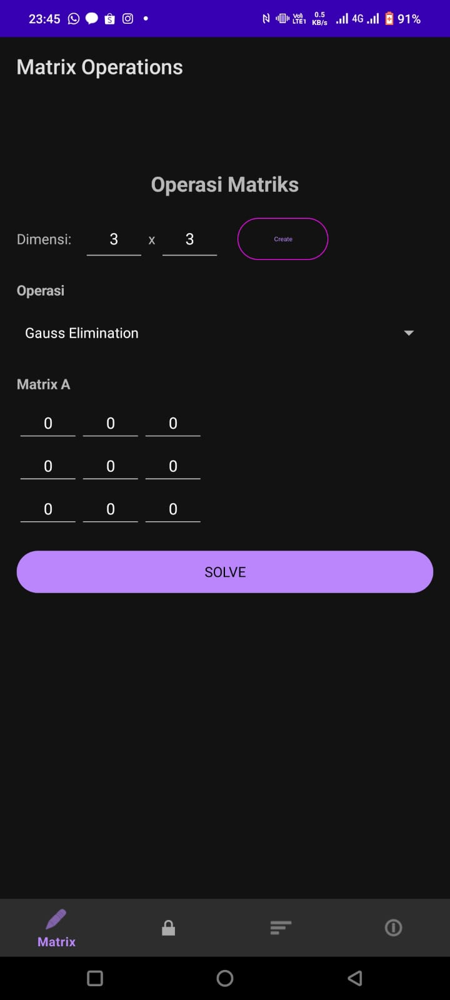
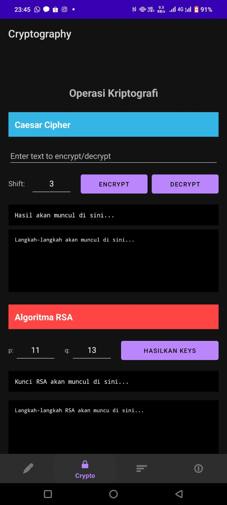
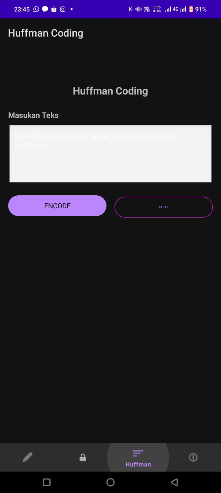
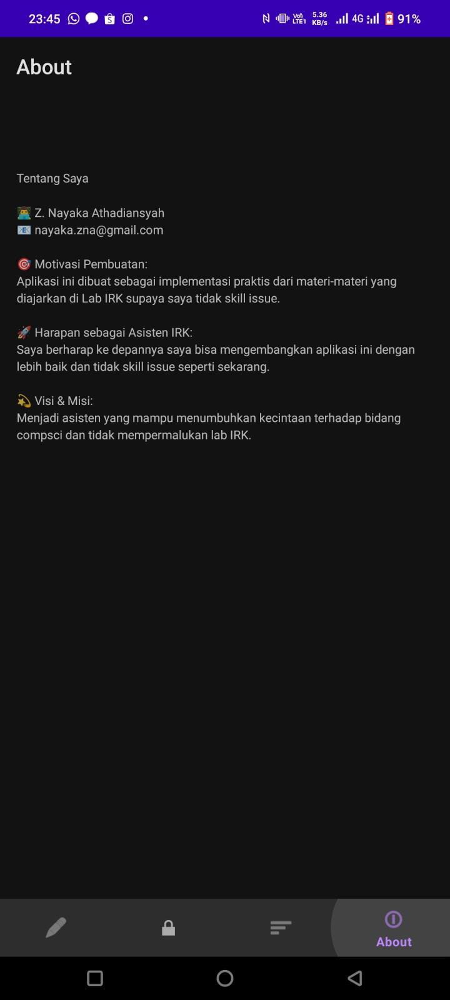

# IRK Library - Aplikasi Android

Aplikasi Android yang mengimplementasikan konsep-konsep penting dari mata kuliah Lab IRK.

Yang ada di dalamnya:
- Aljabar Linear (SPL & Operasi Matrix)
- Kriptografi (Caesar Cipher & RSA) 
- Huffman Coding (Kompresi Data) 
- Strategi Algoritma

---

## 🛠️ **Tech Stack**
- Bahasa: bahassa Kotlin dan bahasa Indonesia
- Platform: Android 8++
- Arsitektur: MVVM
- UI: Materiakl Design 3

### **Dependencies**
```gradle
dependencies {
    implementation 'androidx.core:core-ktx:1.12.0'
    implementation 'androidx.appcompat:appcompat:1.6.1'
    implementation 'com.google.android.material:material:1.11.0'
    implementation 'androidx.constraintlayout:constraintlayout:2.1.4'
    
    implementation 'androidx.lifecycle:lifecycle-livedata-ktx:2.7.0'
    implementation 'androidx.lifecycle:lifecycle-viewmodel-ktx:2.7.0'
    
    implementation 'androidx.navigation:navigation-fragment-ktx:2.7.6'
    implementation 'androidx.navigation:navigation-ui-ktx:2.7.6'
    
    testImplementation 'junit:junit:4.13.2'
    androidTestImplementation 'androidx.test.ext:junit:1.1.5'
    androidTestImplementation 'androidx.test.espresso:espresso-core:3.5.1'
}
```

## 📱 **Cara Install**

### **Prasyarat**
- **Android Studio** (Arctic Fox atau yang lebih baru)
- **Android SDK** minimal API 24 (Android 7.0)
- **Kotlin** 1.8.0+
- **Gradle** 7.0+

### **Step-by-Step Install**

1. **Clone Repository**
   ```bash
   git clone https://github.com/[username-kamu]/IRK-Library-Android.git
   cd IRK-Library-Android
   ```

2. **Buka di Android Studio**
    - Buka Android Studio
    - Pilih "Open an existing project"
    - Cari folder yang udah di-clone
    - Klik folder project

3. **Sync Dependencies**
   ```bash
   # Android Studio bakal otomatis minta sync
   # Atau manual: Tools → Sync Project with Gradle Files
   ```

4. **Build Project**
   ```bash
   # Di Android Studio:
   Build → Clean Project
   Build → Rebuild Project
   ```

5. **Run Aplikasi**
    - Sambungin HP Android (API 24+) atau nyalain emulator
    - Klik tombol "Run" atau tekan `Shift + F10`

### **Alternatif: Install APK Langsung**
1. Download `IRK-Library.apk` dari releases
2. Enable "Unknown Sources" di setting Android
3. Install file APK

---

## ✨ **Fitur-Fitur Keren**

### **🔢 Page 1: Operasi Matrix & Aljabar Linear**


**Algoritma yang Diimplementasi:**
- Eliminasi Gauss
- Gauss-Jordan
- Hitung Determinan 
- Matrix Inverse 
- Aturan Cramer

**Fitur**:
- Input ukuran matrix dinamis (1×1 sampai 6×6)
- Grid input yang interaktif buat masukin elemen matrix
- Dropdown buat pilih operasi
- Input vector b khusus buat Cramer's rule
- Step-by-step solution yang detail
- Validasi input real-time

### **🔐 Page 2: Kriptografi**

**Algoritma yang Diimplementasi:**

#### **Caesar Cipher**
- **Enkripsi:** `c = (p + k) mod 26`
- **Dekripsi:** `p = (c - k) mod 26`
- Support buat huruf besar, kecil, dan karakter non-alphabet

#### **RSA Algorithm**
- **Key Generation:** Pilih prime, n=p×q, φ(n)=(p-1)(q-1)
- **Enkripsi:** `c = m^e mod n`
- **Dekripsi:** `m = c^d mod n`
- Extended Euclidean algorithm buat modular inverse

**Fitur:**
- Caesar cipher dengan custom shift value
- RSA key pair generation dengan input prime
- Step-by-step proses kriptografi
- Enkripsi/dekripsi real-time

### **🌳 Page 3: Huffman Coding**

**Algoritma yang Diimplementasi:**
- Analisis Frekuensi
- Priority Queue
- Tree Building
- Code Generation
- Encoding/Decoding

**Fitur:**
- Input text dengan multiline support
- Visualisasi Tree Interaktif
- Frequency table generation
- Huffman code table
- Statistik kompresi (ukuran asli vs terkompresi)
- Step-by-step proses algoritma
- Verifikasi encode/decode

**Visualisasi Tree:**
- 🟢 **Node hijau:** Leaf nodes (karakter)
- 🔵 **Node biru:** Internal nodes (jumlah frekuensi)
- **Label merah:** "0" (kiri) dan "1" (kanan) paths
- **Canvas scrollable:** Horizontal scrolling buat tree yang gede

### **ℹ️ Page 4: About (Bonus)**

Informasi tentang saya. :D
---

## 🏗️ **Overview Arsitektur**

### **Struktur Folder**
```
IRK-Library-Android/
├── app/
│   ├── src/main/java/com/irk/irk_library/
│   │   ├── MainActivity.kt
│   │   ├── ui/
│   │   │   ├── matrix/           # Page Matrix Operations
│   │   │   │   ├── MatrixFragment.kt
│   │   │   │   └── MatrixViewModel.kt
│   │   │   ├── crypto/           # Page Cryptography
│   │   │   │   ├── CryptoFragment.kt
│   │   │   │   └── CryptoViewModel.kt
│   │   │   ├── huffman/          # Page Huffman Coding
│   │   │   │   ├── HuffmanFragment.kt
│   │   │   │   ├── HuffmanViewModel.kt
│   │   │   │   └── HuffmanTreeView.kt
│   │   │   └── about/            # Page About
│   │   │       ├── AboutFragment.kt
│   │   │       └── AboutViewModel.kt
│   │   └── data/model/           # Model Classes
│   │       ├── Matrix.kt
│   │       ├── CaesarCipher.kt
│   │       ├── Rsa.kt
│   │       ├── Huffman.kt
│   │       └── [Other model files]
│   └── src/main/res/
│       ├── layout/              
│       ├── menu/                 
│       ├── navigation/           
│       └── values/               
├── screenshots/                  
├── IRK-Library.apk              
└── README.md                    
```

### **Pattern MVVM**
- **Model:** Logic bisnis dan algoritma (Matrix, Huffman, RSA, dll), yang nggak ada akhirannya
- **View:** UI Components (Fragment, Layout XML), ada akhran Fragment
- **ViewModel:** Bridge antara View dan Model, handle LiveData, ada akhiran ViewModel

### **Navigation**
- **Bottom Navigation** dengan 4 tabs
- **Navigation Component** buat smooth transitions
- **Fragment-based** architecture

---

## 🧩 **Implementasi Algoritma**

### **Strategi Algoritma yang Dipake**

1. **Divide and Conquer**
    - Implementasi di determinan calculation
    - Tree construction di Huffman

2. **Greedy Algorithm**
    - Huffman coding tree building
    - Optimal code assignment

3. **Dynamic Programming Approach**
    - Matrix operations optimization
    - Step tracking untuk visualisasi
